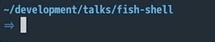

# fish shell

[fish shell](https://fishshell.com) | [tutorial](https://fishshell.com/docs/current/tutorial.html)

> Finally, a command line shell for the 90s

f(riendly)i(interactive)sh(ell) is a modern alternative to bash or zsh.

---

* built-in completions (`Tab` and `Ctrl + f`)
    

---

* lazy-loaded function system
    `$HOME/.config/fish/functions/*.fish`

---

* prompt as readable code(!!)

---

* multiple frameworks (likely unnecessary)

---

* not POSIX compliant
    * [some workarounds](https://github.com/fish-shell/fish-shell/wiki/Bash-Style-Command-Substitution-and-Chaining-(!!-!$-&&-%7C%7C))
    * [`&&` and `!!` coming in v3.0](https://github.com/fish-shell/fish-shell/commit/014b91488db29480160284adfd1cddf286d2888a)
    * `abbr` > `alias`
    * `set foo bar` > `foo=bar`
    * `set -x FOO bar` > `export FOO=bar`

---

* still use bash

---

* global changes - no need to reload shell/tab

---

* speed
